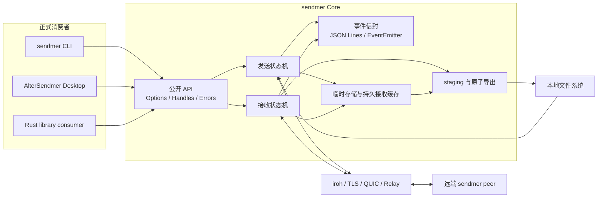

# sendmer 主线设计与开发计划

本文是 sendmer 唯一的主线设计与开发计划。它合并已发布能力、稳定接口约定、当前阶段路线、
验收条件和延期边界。历史迁移指南、版本设计说明和 Release Notes 继续独立保留，但不再作为
当前开发计划的第二来源。

## 1. 术语表与命名约定

| 规范名称 | English / 缩写 | 职责边界 | 不代表什么 |
| --- | --- | --- | --- |
| 核心传输层 | sendmer Core | 提供 Rust crate、CLI、ticket、点对点传输、重试、限速和资源清理 | 不负责桌面 UI、账号或云端文件托管 |
| 桌面客户端 | AlterSendmer Desktop | 通过正式发布的 sendmer API 提供 GPUI 交互、配置、历史和平台集成 | 不复制协议、缓存数据库或限速器 |
| 传输票据 | Ticket | 允许接收方连接并请求内容的 bearer capability | 不是账号、长期授权或云端分享链接 |
| 传输会话 | Transfer Session | 一次 send 或 receive 的应用层生命周期 | 不是单条 QUIC 连接或 provider request |
| 事件信封 | Event Envelope | 承载 schema 版本、会话标识、顺序、阶段和事件载荷 | 不参与控制流，也不替代函数返回值 |
| 结构化错误 | Transfer Error | 提供稳定错误码、失败阶段、可重试属性和安全摘要 | 不是本地化文案或完整内部错误链 |
| 原子导出 | Atomic Export | 完整下载后从 staging 以 no-replace 方式提交最终根 | 不是覆盖、合并或自动重命名已有目标 |
| 上传速率上限 | Upload Rate Limit | 一个 sender 对所有接收方共享的 payload bytes/s 上限 | 不是每个 peer 的独立配额或精确线路 QoS |
| 持久接收缓存 | Persistent Receive Cache | 在多个 receive 进程间复用 iroh 已验证的数据范围 | 不是最终下载目录、云存储或跨设备同步 |
| 缓存排他锁 | Cache Lock | receive 进程对单个缓存条目的跨进程排他占用 | 不是网络会话、ticket 有效期或永久所有权 |

本文、README、代码注释和 AlterSendmer 文档统一使用这些名称。标准协议名 `QUIC`、`TLS`、
`JSON Lines` 和 `SHA-256` 保留标准大小写。

## 2. 产品边界与当前基线

截至 2026-08-26，发布基线是 `sendmer v0.10.0`，对应的正式桌面消费端是
`AlterSendmer v0.6.0`；桌面端通过 crates.io 使用 `sendmer = "0.10.0"`，已完成会话控制、
TM1 选择、跨进程回归、原生验收和正式发布。上一桌面版本 `v0.5.0` 仍对应
`sendmer = "0.9.0"`。主产品仍是隐私优先的一次性文件传输：
不要求账号、自建服务器或云端存储。拿到有效传输票据的接收方
即可使用，因此票据只能通过可信渠道分享，并应被视为敏感信息。

核心传输层负责：

- 基于 iroh、TLS 和 QUIC 的直连、NAT 穿透与 relay 回退。
- 文件和目录的导入、请求、重试、超时、原子导出、路径安全及清理。
- `SendHandle`、receive 取消、结构化错误、版本化事件和 JSON Lines 输出。
- sender 共享上传限速和可选持久接收缓存。

当前阶段事实：`sendmer v0.10.0` 的 tag 指向 `fe1f475`；`AlterSendmer v0.6.0` 的 Release
workflow `32866559790` 已完成三个平台打包、签名、SBOM、provenance、更新清单和 checksum，
共上传 23 个资产。当前没有 `v0.11` tag；下一阶段先做质量改进和证据补齐，不预先承诺核心版本号。

核心传输层不负责：

- GPUI 状态、语言、主题、历史、系统文件选择器和应用更新。
- 账号、云端文件托管、多租户控制面、后台同步服务或自建 relay 运维。
- 在没有明确 backpressure 设计前伪造接收端下载限速。

## 3. 总体架构与依赖方向



依赖方向只能从消费者指向公开 API。AlterSendmer 不得依赖 iroh 内部类型、缓存布局、Router
或临时目录；sendmer 也不得反向依赖 GPUI。跨项目发布依赖必须使用 crates.io 上的 sendmer
版本号，不使用本地 path、Git revision 或提交哈希作为发布依赖。

## 4. 已冻结的核心接口约定

### 4.1 生命周期、取消与资源所有权

- `SendHandle` 是发送会话的 opaque 所有者，负责 `status`、`cancel` 和 `close`；兼容用旧 API
  不应成为新消费者的首选。
- `SendHandle::cancel` 是主动撤销：它先唤醒并停止 provider，再关闭 router，因此旧 Ticket
  只在 router 存活期间有效；Ticket 是 bearer capability，不代表账号、持久 ACL 或撤销列表。
- sender 关闭时依次停止 router/progress/store，释放文件句柄后再删除临时目录。
- receive 取消、失败和成功都必须有单一终态；清理失败保留原始业务错误并附加清理上下文。
- 单个接收方完成或中止不会终止整个 sender 会话，CLI 默认持续共享到用户主动停止。

### 4.2 接收、路径和数据完整性

- 下载阶段在同一次 receive 中复用已验证范围，并按策略重连；连接、元数据和下载空闲超时均
  可配置，未配置时保持底层默认行为。
- 导出先写入输出目录内的 staging，确认全部 `Done` 后再提交最终根；流提前结束视为失败。
- 冲突策略固定为 `fail`：已有文件、目录或符号链接不覆盖、不合并、不自动重命名。
- 导出提交使用平台 no-replace 原语；路径 traversal、绝对路径、symlink 逃逸和多顶层根均拒绝。
- 当前 collection 只表示常规文件。空目录、空子目录和符号链接在发送端明确拒绝，不静默丢失。

### 4.3 上传速率上限

- `SendOptions::max_upload_rate_bytes_per_sec` 和 CLI `--max-upload-rate` 接受非零 bytes/s；未设置
  表示不启用 throttle 路径。
- provider 的 throttle 事件按实际 chunk `size` 在一个共享时间线中调度，所有接收方共享同一
  sender 总上限。
- 限速只覆盖文件 payload，不承诺包含 Bao、QUIC 或 relay 开销；拥塞、磁盘和对端速度可以让
  实际吞吐低于配置值。
- 本版本不提供每个 peer 独立配额、运行中动态调速或接收端 sleep 限速。

### 4.4 事件信封与结构化错误

事件 schema `1` 的稳定字段如下：

| 字段 | 规则 |
| --- | --- |
| `schema_version` | 固定为 `1`，它不是 crate 版本 |
| `session_id` | 独立随机 128 位标识，不从 ticket、hash 或网络身份派生 |
| `sequence` | 每个会话从 `1` 严格递增，消费者以它判断顺序 |
| `timestamp_ms` | Unix epoch 毫秒，仅用于展示和跨进程关联 |
| `role` | `sender` 或 `receiver` |
| `phase` | `preparing`、`connecting`、`metadata`、`transferring`、`exporting`、`finalizing` |
| `event` | `started`、`progress`、`file_names` 或唯一终态 |

`completed`、`failed`、`cancelled` 三种终态互斥且只发出一次。公开错误码包括
`invalid_input`、`connection_failed`、`timeout`、`remote_rejected`、`transfer_interrupted`、
`target_conflict`、`filesystem` 和 `internal`。事件不得包含完整 ticket、绝对路径、私钥、
relay token 或底层连接标识。

### 4.5 持久接收缓存

- 未显式配置缓存时使用进程级临时 store，结束后清理；显式启用时按内容 hash 和 blob 格式
  选择缓存条目。
- `manifest.json` 只保存布局/schema 版本、缓存键、创建或刷新时间和 TTL；不保存完整 ticket、
  发送方地址、最终绝对路径或 GUI 历史。
- 同一条目使用非阻塞排他锁；缓存根维护锁和条目锁遵循固定顺序，进程崩溃后由操作系统
  释放句柄。
- 失败、超时或取消后保留已验证数据；后续进程通过 `local().missing()` 请求缺失范围；成功
  原子导出后删除对应条目。
- prune 只删除已过期、schema 已知且未被占用的条目；活动、损坏、未知或未来 schema 数据保留。
- 跨进程恢复仍要求有效 ticket 和可重新连接的发送端，不是离线下载或永久会话。

## 5. 已完成版本与跨项目对齐

| 核心版本 | 已完成能力 | 对应桌面版本 |
| --- | --- | --- |
| `v0.6.0` | 原子导出、no-replace、数据重试/超时、路径与清理基线 | 早期 GPUI 主线 |
| `v0.7.0` | `SendHandle`、receive 取消、sender 共享上传限速、基础 JSON 事件 | `AlterSendmer v0.3.0` |
| `v0.8.0` | 版本化事件信封、严格序号、单终态与结构化错误 | `AlterSendmer v0.4.0` |
| `v0.9.0` | 持久接收缓存、TTL/prune、跨进程中断与发送端重启恢复 | `AlterSendmer v0.5.0` |
| `v0.10.0` | 会话生命周期与资源上限、TM1 manifest、供应链证明和六平台发布覆盖 | `AlterSendmer v0.6.0` |

`AlterSendmer v0.6.0` 使用 `sendmer = "0.10.0"`，只映射公开配置、事件和结构化错误：上传
上限以 MiB/s 输入后转换为 bytes/s；持久缓存默认启用并提供 `1 / 7 / 30` 天新条目 TTL 和安全
prune；会话过期、接收方上限和 TM1 通过公开选项与结果展示。缓存格式、锁、恢复状态机、manifest
解析和实际限速器仍只由核心传输层维护。桌面端发布遵循第 8 节的跨项目顺序，不使用本地 path
或 Git revision 绕过正式版本。

## 6. v0.10.0 已完成范围与验收

`v0.10.0` 已完成设计评审、实现、独立测试和正式发布。以下记录冻结范围与验收边界；不把
协议、GUI 或服务端架构追加到已发布版本。

### M10.1 会话控制与规模边界

- `SendOptions::max_receivers` 与 CLI `--max-receivers` 已实现同时活动 provider 连接数上限；默认不限制，断开连接会释放名额，超限连接由 provider 层拒绝。
- `SendOptions::max_files` 与 CLI `--max-files` 已实现普通文件数量上限；默认不限制，目录超限会在网络和临时存储初始化前以 `InvalidInput` 拒绝。
- `SendOptions::max_total_size_bytes` 与 CLI `--max-total-size` 已实现普通文件总 payload 大小上限；默认不限制，文件长度总量超限会在网络和临时存储初始化前以 `InvalidInput` 拒绝。
- `SendHandle::cancel` 的主动撤销和旧 Ticket 失效已有本地回归；`SendOptions::session_lifetime` 与
  CLI `--session-lifetime-seconds` 已实现 ready 后固定生命周期、`Expired` 状态和不可重试超时事件，
  不改变现有 Ticket 的 bearer capability 兼容性；设计与边界见
  [`V0_10_SESSION_LIFETIME_DESIGN.md`](V0_10_SESSION_LIFETIME_DESIGN.md)。
- `SendOptions::max_import_memory_bytes` 与 CLI `--max-import-memory` 已实现导入工作集预算；它限制并行
  导入任务估算的普通文件字节，不伪称为进程 RSS 或操作系统硬内存上限。大文件和大目录基准已记录在
  [`V0_10_SCALE_BENCHMARK.md`](V0_10_SCALE_BENCHMARK.md)。
- 已补两个真实并行接收方共享总上传上限的本地 E2E；sender 关闭会立即唤醒并终止尚未放行
  的限速等待；relay-only 与弱网重启 smoke 均已提供显式 opt-in 测试。

验收：控制操作有稳定 API/错误码；现有 ticket 默认行为兼容；资源上限不会破坏取消、清理或
多接收方状态；基准结果记录环境并避免把网络抖动写成严格单点时序断言。

### M10.2 文件系统语义与 manifest 演进

- TM1 版本化传输清单已冻结术语、wire schema、路径编码、元数据边界和旧 Collection V0
  兼容规则，详见 [`V0_10_MANIFEST_DESIGN.md`](V0_10_MANIFEST_DESIGN.md)。
- `--manifest` 与 `SendOptions::manifest_mode` 已提供显式 opt-in：使用保留 Collection 条目
  携带 TM1 JSON，接收端自动识别并在 staging 中还原空目录、普通文件、POSIX mode/Windows
  read-only 属性和修改时间；旧 file-only collection 仍保持默认。
- TM1 对路径、payload 映射、重复项、未来 schema 和目录/文件冲突执行 fail-closed 校验；Unix
  非 UTF-8 组件使用 `unix_bytes_hex`，无法安全 materialize 的目标平台拒绝而不替换名称。
- 符号链接默认继续拒绝；只有威胁模型、目标平台语义和安全导出策略明确后才考虑 opt-in。
- 保持旧 file-only collection 可读取，并提供明确的 schema 迁移和不支持错误。

验收：Windows UTF-8 round-trip 和空目录 fixture 已通过；manifest JSON、恶意路径、未来 schema、
文件/目录冲突、Unix 非 UTF-8 文件名、Unix mode 和跨平台时间戳均有测试。CI 的原生矩阵覆盖
Linux、macOS、Windows（MSVC/GNU），并将真实权限/时间戳与原始名称检查作为发布前检查；当前
开发机已完成 Windows 与 WSL Linux 全量测试，macOS 结果仍以对应 runner 的 CI 记录为准。
失败或冲突时仍无半导出和越界写入。

### M10.3 供应链与平台覆盖

- Release 资产的签名、SBOM 和构建 provenance 约定已冻结，详见
  [`V0_10_RELEASE_PROVENANCE.md`](V0_10_RELEASE_PROVENANCE.md)，并已接入 release workflow：每个
  target 在上传前生成 SPDX SBOM、archive/SBOM Sigstore bundle 和 GitHub provenance bundle。
- Unix 与 PowerShell 安装器在解压前下载并校验 checksum、签名 bundle 和 provenance 文件；缺失
  `cosign` 或任一信任材料为空时 fail closed。
- CI native acceptance 已覆盖 Linux x86_64/ARM64、macOS Intel/ARM64 和 Windows MSVC/GNU；
  release workflow 仍保留 Linux/macOS ARM64 的交叉构建与资产发布矩阵。
- 保持 release workflow 可重入：同一 tag 重跑时更新 Release 正文，不制造重复资产或版本。

验收：签名与校验失败均 fail closed；SBOM/provenance 可由发布 tag 追溯；所有资产名、checksum、
安装器选择规则和 CI native platform matrix 均有自动化测试。

## 7. 下一阶段：质量改进与可演进性（2026-08-26 起）

### 7.1 阶段目标与版本策略

本阶段以已发布的 `sendmer v0.10.0` 和 `AlterSendmer v0.6.0` 为稳定基线，先提升桌面端的
可用性、可访问性和诊断质量，再用可复现证据决定是否需要新的核心版本。默认策略如下：

1. 只改 AlterSendmer 的界面、偏好、历史或打包行为时，发布桌面补丁或次版本，不升级 sendmer。
2. 只修复 sendmer 中可复现的回归、清理、跨平台或发布工程问题时，按 SemVer 评估
   `v0.10.1`；修复必须保持已有公开接口和默认行为。
3. 只有确实需要新的公开 API 或传输语义时，才启动 `sendmer v0.11.0` 候选；在设计、兼容性、
   测试和迁移说明完成前，不创建 `v0.11` tag。

本阶段不以增加协议功能数量为完成标准，而以用户可完成一次可靠传输、开发者可消费稳定事件、
维护者可复现发布结果为完成标准。每个批次均须有负责人、前置条件、出口证据和失败处理。

### 7.2 开发批次

| 批次 | 状态 | 负责仓库 | 主要工作 | 前置条件 | 出口证据 |
| --- | --- | --- | --- | --- | --- |
| N11.0 基线冻结 | 已完成本次整理 | 两个仓库 | 记录版本、tag、依赖来源、测试矩阵、未完成项和敏感信息清单；清除旧计划引用 | `v0.10.0`、`AlterSendmer v0.6.0` 可回读 | 本文件基线记录、干净工作区、链接检查和公开 API 清单 |
| A11.1 桌面质量 | 待启动 | AlterSendmer | 长 ticket、键盘焦点、AccessKit 标签、最小窗口、高 DPI、21 种语言、历史/偏好迁移、诊断导出、退出清理和更新失败恢复 | N11.0；不需要新的 sendmer API | Windows 真实截图与操作日志、Linux/macOS 原生 CI、locale 完整性和隐私检查 |
| C11.1 核心可靠性 | 待启动 | sendmer | 补齐 sender 中断/过期、receiver 取消/重试、持久缓存恢复、接收方上限释放、staging 清理和冲突保护的跨进程回归；只修复可复现问题 | N11.0；发现缺陷时建立最小复现 | locked workspace 测试、失败日志、无半导出、无临时目录泄漏、目标内容不变 |
| C11.2 可观测性评审 | 待启动 | sendmer 与 AlterSendmer | 固定 JSON Lines 的 stdout/stderr 边界、schema `1` 序号/终态、结构化错误和敏感字段脱敏；评估是否需要新的缓存诊断或运行时控制 API | C11.1；新 API 必须先在本文件冻结边界 | rustdoc、可编译示例、事件 fixture、未知字段/乱序事件测试和迁移说明 |
| R11.1 发布可复现性 | 待启动 | 两个仓库 | 维护六平台 CI、原生验收、安装器失败清理、release notes 提交范围、checksum、签名、SBOM、provenance 和重跑幂等性 | A11.1/C11.1/C11.2 相关批次通过 | actionlint、版本/资产/安装器测试、release rehearsal、GitHub workflow 与资产清单 |
| D11.1 版本决策 | 待启动 | 两个仓库 | 根据实际变更选择桌面次版本、sendmer `0.10.1` 或 `0.11.0`；同步 README、版本矩阵和迁移入口 | R11.1 通过且没有未完成项 | tag、crate、Release、依赖解析和两仓库文档可回读 |

每个批次只解决一个可验收主题。测试、原生验收或发布证据缺失时，批次保持“进行中”，不得
通过文档措辞标记为完成；relay 或弱网服务不可达时只记录“未执行”和前置条件。

### 7.3 批次实施细则

#### N11.0：基线冻结

- 核对 `Cargo.toml`、`Cargo.lock`、crates.io source、远端 tag、GitHub Release 和两个仓库的
  `main` 状态；记录核对日期和提交，而不是沿用旧执行记录中的数字。
- 建立公开 API 使用清单：`SendOptions`、`ReceiveOptions`、`SendHandle`、
  `ReceiveCacheOptions`、`TransferEventEnvelope`、`TransferError` 和 `prune_receive_cache`。
- 建立日志脱敏清单：完整 ticket、绝对路径、节点密钥、relay token、底层连接标识和缓存内部
  路径不得进入事件、历史、诊断导出或 Release 产物。
- 将过时的下一阶段文件从仓库移除；版本设计、迁移指南和历史 Release Notes 仍按其用途保留，
  不把它们当作当前开发计划。

出口条件：两个仓库版本和远端状态有可回读记录；`rg` 找不到已删除计划的引用；本文件成为唯一
当前计划来源。

#### A11.1：桌面质量

- 长 ticket 输入、粘贴、选择、错误摘要和重试按钮在默认窗口、最小窗口和高 DPI 下不遮挡，
  旧 generation 的异步结果不能覆盖新任务。
- 为键盘焦点、AccessKit 标签、语言浮层和帮助展开补齐可重复验收；English 和简体中文必须
  覆盖新增文案，其余 locale 保持完整性检查通过。
- 偏好和旧历史 JSON 使用兼容默认值；诊断导出只包含角色、阶段、错误码、序号、耗时和安全
  摘要，不复制 ticket、绝对路径或内部缓存字段。
- 应用退出先停止 sender、再取消并等待 receiver，更新下载或校验失败后保留可恢复状态。

出口条件：Windows 截图和操作日志覆盖默认/最小窗口、长 ticket、失败重试、设置页和语言浮层；
Linux/macOS CI 有对应结果；无 sendmer 私有类型进入桌面代码。

#### C11.1：核心可靠性

- 为 sender `SendHandle::cancel`、session lifetime、`max_receivers` 和 receiver cancellation
  保留真实跨进程测试，验证旧 ticket 失效、名额释放、单一终态和资源关闭顺序。
- 为临时 store 与持久接收缓存覆盖失败、取消、重启恢复、成功导出清理、prune 保留活动/损坏/
  未来 schema 条目等场景；输出目录冲突时目标内容保持不变。
- 将重试、连接、元数据和下载空闲超时限制在有界范围；失败信息使用结构化错误码，不以底层
  文本作为分支条件。
- 任何 relay-only 或弱网测试必须显式设置 `SENDMER_RELAY_SMOKE=1` 或
  `SENDMER_WEAK_NETWORK_SMOKE=1`；没有可达服务时保留 ignored 状态，不伪造通过。

出口条件：正常、失败、取消和过期路径均有日志或测试证据；staging、sender 临时目录和文件
句柄在失败后清理；无可复现问题时只提交测试/文档改进，不为了凑版本引入语义变化。

#### C11.2：可观测性与 API 评审

- 为 `TransferEventEnvelope` 固定 `schema_version`、`session_id`、严格递增 `sequence`、阶段、
  终态互斥和安全错误字段；未知 schema、重复序号和序号缺口必须安全失败。
- 验证 `--json-events` 只向 stdout 输出事件，日志和人类可读文本向 stderr 输出；事件和历史
  不得包含敏感信息。
- 公开 API 变化必须同时更新 rustdoc、示例、fixture、迁移说明和桌面适配清单；若没有明确用户
  场景，不新增动态限速、接收端限速或缓存内部管理 API。

出口条件：接口 fixture、文档示例和 API 使用清单在 stable、MSRV 和 `--all-features` 下
通过；发现破坏性变化时停止发布决策，先制定迁移路径。

#### R11.1：发布可复现性

- CI 继续覆盖 Linux x86_64/ARM64、macOS Intel/ARM64 和 Windows MSVC/GNU；原生文件名、权限、
  时间戳和窗口结果以对应 runner 的证据为准。
- release workflow 必须从目标 tag checkout，Release 正文由 tag 提交范围生成，并在重跑同一
  tag 时幂等更新；手动 dispatch 也必须让 provenance identity 与实际 workflow ref 一致。
- 每个平台资产必须和 `.sha256`、签名 bundle、SPDX SBOM 与 GitHub provenance 成组；安装器在
  解压前验证 checksum、签名和 provenance，缺少任一信任材料时停止。
- 记录 workflow run、tag commit、Release URL、资产数量和关键资产名称；不把 Node.js action
  弃用提示误判成发布成功或失败。

出口条件：release rehearsal、安装器失败清理、资产格式检查、release notes 格式检查和签名/provenance
校验全部通过；任何一项失败都不创建新 tag。

### 7.4 验收矩阵

| 场景 | 预期结果 | 必须保留的证据 |
| --- | --- | --- |
| legacy Collection V0 | 默认发送/接收、no-replace 和旧历史兼容 | 核心回归、桌面 adapter 测试 |
| TM1 清单 | 空目录和支持的元数据在 staging 完成校验后一次性导出 | 跨平台文件系统测试、失败无半导出日志 |
| 会话过期与主动撤销 | `Expired`、`Timeout`、取消和普通失败可区分；旧 ticket 失效 | sender/receiver E2E、清理断言 |
| 接收方上限 | 超限连接不能绕过上限；断开后名额释放 | 并发 fixture、稳定错误码 |
| 缓存恢复 | 失败/取消可恢复，成功导出后删除已完成条目；未知数据保留 | cache integration test、prune report |
| 事件与诊断 | 序号严格递增、终态唯一、stdout/stderr 分离、敏感字段不出现 | fixture、脱敏测试、诊断样本 |
| 桌面原生体验 | 长 ticket、键盘焦点、最小窗口、高 DPI 和语言浮层不遮挡 | Windows 截图/日志、Linux/macOS CI |
| 发布资产 | 包、checksum、签名、SBOM、provenance、更新清单版本一致 | rehearsal、workflow run、Release 资产清单 |

### 7.5 阶段完成定义

只有同时满足以下条件，才把本阶段标记为完成：

- N11.0 的版本、依赖来源、公开 API 和敏感信息清单已更新，仓库中没有第二份当前开发计划。
- A11.1 的桌面质量改进通过真实窗口和三平台 CI 验收；不需要核心新 API 的事项不得反向扩大
  sendmer 范围。
- C11.1 的可靠性回归覆盖正常、失败、取消、过期、缓存恢复和冲突保护；发现的核心缺陷已按
  独立 `fix:` 批次验证，未发现缺陷时保留测试和未执行项证据。
- C11.2 的事件、错误、诊断和公开 API 约定有 fixture、rustdoc、示例和迁移说明；未知输入仍
  采用安全失败。
- R11.1 的所有发布前检查通过，Release 资产可以由 tag、checksum、签名和 provenance 回读。
- D11.1 已根据实际变更完成版本选择，README、版本矩阵、迁移入口和 Release notes 没有漂移，
  两个仓库工作区均干净并已推送。

## 8. 质量验收与发布顺序

每个 sendmer 功能或修复提交前至少执行：

```text
cargo fmt --all -- --check
cargo clippy --locked --workspace --all-targets --all-features -- -D warnings
cargo test --locked --workspace --all-features --bins --tests --examples
cargo check --workspace --all-features --bins
```

涉及公开 API 时增加 `cargo doc --locked --workspace --all-features --no-deps`、rustdoc 示例和
接口 fixture；涉及 CLI、安装器或 workflow 时增加参数测试、actionlint、安装器测试和
release rehearsal。桌面变更还必须有真实窗口或原生 runner 证据。版本 tag 只能指向这些检查全部
通过的提交。

跨项目发布顺序固定为：

1. 在 sendmer 完成功能、测试、文档和版本提交；若是桌面独立改进，则保持 `sendmer v0.10.0` 不变。
2. 核心版本变更先发布 crate 与 GitHub Release，并确认 crates.io 可解析该版本。
3. AlterSendmer 只能使用正式 registry 版本，完成适配、跨项目回归、三平台 CI 和原生验收。
4. 发布 AlterSendmer，并回读 tag、Release、资产和两仓库版本矩阵。
5. 任一测试、原生验收、签名、远端或发布步骤失败时停止，不创建或推送未验证 tag。

每个已完成小功能使用单一范围的 Conventional Commit（`feat:`、`fix:`、`test:`、`docs:`、
`chore:` 等），测试通过后立即推送当前分支。未完成批次保留在本文件的“进行中”状态，不用
额外计划文件掩盖未完成项。

## 9. 风险、回退和延期边界

| 风险 | 识别信号 | 处理方式 |
| --- | --- | --- |
| registry 依赖漂移 | `Cargo.lock` source 不是 crates.io，或出现 path/Git revision | 停止桌面批次，恢复正式版本依赖并重新运行 locked 检查 |
| 事件/错误语义被 UI 猜测 | 代码按 `message`、ticket 是否可连通或底层连接 ID 分支 | 退回公开状态、错误码和序号；补 fixture 后再合并 |
| 跨平台文件系统差异 | Windows、Linux、macOS 结果不一致 | 保留平台特定证据；必要时拆分修复，禁止用单机结果覆盖其他平台 |
| relay/弱网环境不可用 | opt-in smoke 无可达 relay | 标记“未执行”，保留命令和前置条件，不修改通过结论 |
| 发布证明失败 | checksum、签名、SBOM、provenance 或 identity 校验失败 | 不创建新 tag；修复 workflow 后从同一版本重新 rehearsal |
| 范围膨胀 | 出现账号、云端存储、daemon 或新控制面需求 | 退回产品评审；除非另立产品方案，不进入一次性传输主线 |

回退原则：未打 tag 的批次可以独立回退；已发布版本只通过新的修复版本纠正，不重写已发布
tag、版本化接口说明或用户已有目标文件。

以下方向继续延期，除非先完成独立产品和安全设计：后台 daemon、跨设备同步、账号/多租户、
云端文件托管、自建 relay 运维、接收端下载限速、每个接收方独立配额、运行中动态调速、符号
链接传输以及 ACL/owner/security descriptor 等超出 TM1 v1 的文件系统语义。

## 10. 文档维护规则

- 本文件是架构、稳定接口约定、版本矩阵、当前批次和未来路线的唯一主线来源。
- `README.md` 与 `README_ZH.md` 只保留用户操作、公开 API 和边界；`DEVELOPMENT.md` 只保留贡献、
  本地检查和发布流程。
- `V0_8_MIGRATION.md`、`V0_10_MANIFEST_DESIGN.md`、`V0_10_SESSION_LIFETIME_DESIGN.md`、
  `V0_10_SCALE_BENCHMARK.md`、`V0_10_RELEASE_PROVENANCE.md` 和历史 Release Notes 是版本化技术
  资料，不承担当前计划，也不复制本文件的未来路线。
- 不再新增第二份长期计划或按功能拆分的长期计划；复杂功能先在本文件冻结
  责任边界、输入输出、失败行为和验收证据，再在代码与提交中记录实施细节。
- 每次 sendmer 或 AlterSendmer 发布后同步更新第 2、5、7 节，核对依赖版本、tag、Release 和
  剩余延期项；旧执行记录只通过 Git 历史追溯。
