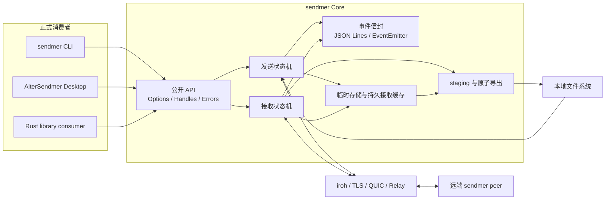

# sendmer 主线设计与开发计划

本文是 sendmer 唯一的主线设计与开发计划。它合并了早期里程碑、后续路线、上传限速、
版本化事件和持久接收缓存文档中的有效契约。历史迁移指南和 Release Notes 继续独立保留，
但不再作为当前设计的第二来源。

## 1. 术语表与命名约定

| 规范名称 | English / 缩写 | 职责边界 | 不代表什么 |
| --- | --- | --- | --- |
| 核心传输层 | sendmer Core | 提供 Rust crate、CLI、ticket、点对点传输、重试、限速和资源清理 | 不负责桌面 UI、账号或云端文件托管 |
| 桌面客户端 | AlterSendmer Desktop | 通过正式发布的 sendmer API 提供 GPUI 交互、配置、历史和平台集成 | 不复制协议、缓存数据库或限速器 |
| 传输票据 | Ticket | 允许接收方连接并请求内容的 bearer capability | 不是账号、长期授权或云端分享链接 |
| 传输会话 | Transfer Session | 一次 send 或 receive 的应用层生命周期 | 不是单条 QUIC 连接或 provider request |
| 事件信封 | Event Envelope | 承载 schema 版本、会话标识、顺序、阶段和事件载荷 | 不参与控制流，也不替代函数返回值 |
| 结构化错误 | Transfer Error | 提供稳定错误码、失败阶段、可重试属性和安全摘要 | 不是本地化文案或完整内部错误链 |
| 原子导出 | Atomic Export | 完整下载后从 staging 以 no-replace 方式提交最终根 | 不是覆盖、合并或自动重命名已有目标 |
| 上传速率上限 | Upload Rate Limit | 一个 sender 对所有接收方共享的 payload bytes/s 上限 | 不是每个 peer 的独立配额或精确线路 QoS |
| 持久接收缓存 | Persistent Receive Cache | 在多个 receive 进程间复用 iroh 已验证的数据范围 | 不是最终下载目录、云存储或跨设备同步 |
| 缓存租约 | Cache Lease | receive 进程对单个缓存条目的跨进程排他锁 | 不是网络会话、ticket 有效期或永久所有权 |

本文、README、代码注释和 AlterSendmer 文档统一使用这些名称。标准协议名 `QUIC`、`TLS`、
`JSON Lines` 和 `SHA-256` 保留标准大小写。

## 2. 产品边界与当前基线

当前发布基线是 `sendmer v0.9.0`，对应的桌面消费端是 `AlterSendmer v0.5.0`。主产品仍是
隐私优先的一次性文件传输：不要求账号、自建服务器或云端存储。拿到有效传输票据的接收方
即可使用，因此票据只能通过可信渠道分享，并应被视为敏感信息。

核心传输层负责：

- 基于 iroh、TLS 和 QUIC 的直连、NAT 穿透与 relay 回退。
- 文件和目录的导入、请求、重试、超时、原子导出、路径安全及清理。
- `SendHandle`、receive 取消、结构化错误、版本化事件和 JSON Lines 输出。
- sender 共享上传限速和可选持久接收缓存。

核心传输层不负责：

- GPUI 状态、语言、主题、历史、系统文件选择器和应用更新。
- 账号、云端文件托管、多租户控制面、后台同步服务或自建 relay 运维。
- 在没有明确 backpressure 设计前伪造接收端下载限速。

## 3. 总体架构与依赖方向



依赖方向只能从消费者指向公开 API。AlterSendmer 不得依赖 iroh 内部类型、缓存布局、Router
或临时目录；sendmer 也不得反向依赖 GPUI。跨项目发布依赖必须使用 crates.io 上的 sendmer
版本号，不使用本地 path、Git revision 或提交哈希作为发布依赖。

## 4. 已冻结的核心契约

### 4.1 生命周期、取消与资源所有权

- `SendHandle` 是发送会话的 opaque 所有者，负责 `status`、`cancel` 和 `close`；兼容用旧 API
  不应成为新消费者的首选。
- `SendHandle::cancel` 是主动撤销：它先唤醒并停止 provider，再关闭 router，因此旧 Ticket
  只在 router 存活期间有效；Ticket 是 bearer capability，不代表账号、持久 ACL 或撤销列表。
- sender 关闭时依次停止 router/progress/store，释放文件句柄后再删除临时目录。
- receive 取消、失败和成功都必须有单一终态；清理失败保留原始业务错误并附加清理上下文。
- 单个接收方完成或中止不会终止整个 sender 会话，CLI 默认持续共享到用户主动停止。

### 4.2 接收、路径和数据完整性

- 下载阶段在同一次 receive 中复用已验证范围，并按策略重连；连接、元数据和下载空闲超时均
  可配置，未配置时保持底层默认行为。
- 导出先写入输出目录内的 staging，确认全部 `Done` 后再提交最终根；流提前结束视为失败。
- 冲突策略固定为 `fail`：已有文件、目录或符号链接不覆盖、不合并、不自动重命名。
- 导出提交使用平台 no-replace 原语；路径 traversal、绝对路径、symlink 逃逸和多顶层根均拒绝。
- 当前 collection 只表示常规文件。空目录、空子目录和符号链接在发送端明确拒绝，不静默丢失。

### 4.3 上传速率上限

- `SendOptions::max_upload_rate_bytes_per_sec` 和 CLI `--max-upload-rate` 接受非零 bytes/s；未设置
  表示不启用 throttle 路径。
- provider 的 throttle 事件按实际 chunk `size` 在一个共享时间线中调度，所有接收方共享同一
  sender 总上限。
- 限速只覆盖文件 payload，不承诺包含 Bao、QUIC 或 relay 开销；拥塞、磁盘和对端速度可以让
  实际吞吐低于配置值。
- 本版本不提供每个 peer 独立配额、运行中动态调速或接收端 sleep 限速。

### 4.4 事件信封与结构化错误

事件 schema `1` 的稳定字段如下：

| 字段 | 规则 |
| --- | --- |
| `schema_version` | 固定为 `1`，它不是 crate 版本 |
| `session_id` | 独立随机 128 位标识，不从 ticket、hash 或网络身份派生 |
| `sequence` | 每个会话从 `1` 严格递增，消费者以它判断顺序 |
| `timestamp_ms` | Unix epoch 毫秒，仅用于展示和跨进程关联 |
| `role` | `sender` 或 `receiver` |
| `phase` | `preparing`、`connecting`、`metadata`、`transferring`、`exporting`、`finalizing` |
| `event` | `started`、`progress`、`file_names` 或唯一终态 |

`completed`、`failed`、`cancelled` 三种终态互斥且只发出一次。公开错误码包括
`invalid_input`、`connection_failed`、`timeout`、`remote_rejected`、`transfer_interrupted`、
`target_conflict`、`filesystem` 和 `internal`。事件不得包含完整 ticket、绝对路径、私钥、
relay token 或底层连接标识。

### 4.5 持久接收缓存

- 未显式配置缓存时使用进程级临时 store，结束后清理；显式启用时按内容 hash 和 blob 格式
  选择缓存条目。
- `manifest.json` 只保存布局/schema 版本、缓存键、创建或刷新时间和 TTL；不保存完整 ticket、
  发送方地址、最终绝对路径或 GUI 历史。
- 同一条目使用非阻塞排他租约；缓存根维护锁和条目锁遵循固定顺序，进程崩溃后由操作系统
  释放句柄。
- 失败、超时或取消后保留已验证数据；后续进程通过 `local().missing()` 请求缺失范围；成功
  原子导出后删除对应条目。
- prune 只删除已过期、schema 已知且未被占用的条目；活动、损坏、未知或未来 schema 数据保留。
- 跨进程恢复仍要求有效 ticket 和可重新连接的发送端，不是离线下载或永久会话。

## 5. 已完成版本与跨项目对齐

| 核心版本 | 已完成能力 | 对应桌面版本 |
| --- | --- | --- |
| `v0.6.0` | 原子导出、no-replace、数据重试/超时、路径与清理基线 | 早期 GPUI 主线 |
| `v0.7.0` | `SendHandle`、receive 取消、sender 共享上传限速、基础 JSON 事件 | `AlterSendmer v0.3.0` |
| `v0.8.0` | 版本化事件信封、严格序号、单终态与结构化错误 | `AlterSendmer v0.4.0` |
| `v0.9.0` | 持久接收缓存、TTL/prune、跨进程中断与发送端重启恢复 | `AlterSendmer v0.5.0` |

`AlterSendmer v0.5.0` 使用 `sendmer = "0.9.0"`，只映射公开配置和事件：上传上限以 MiB/s
输入后转换为 bytes/s；持久缓存默认启用并提供 `1 / 7 / 30` 天新条目 TTL 和安全 prune。
缓存格式、锁、恢复状态机和实际限速器仍只由核心传输层维护。

## 6. 下一主线：v0.10.0 候选范围

`v0.10.0` 只在每个批次完成设计评审和独立测试后冻结范围，不把协议、GUI 和服务端架构塞入
同一版本。

### M10.1 会话控制与规模边界

- `SendOptions::max_receivers` 与 CLI `--max-receivers` 已实现同时活动 provider 连接数上限；默认不限制，断开连接会释放名额，超限连接由 provider 层拒绝。
- `SendOptions::max_files` 与 CLI `--max-files` 已实现普通文件数量上限；默认不限制，目录超限会在网络和临时存储初始化前以 `InvalidInput` 拒绝。
- `SendOptions::max_total_size_bytes` 与 CLI `--max-total-size` 已实现普通文件总 payload 大小上限；默认不限制，文件长度总量超限会在网络和临时存储初始化前以 `InvalidInput` 拒绝。
- `SendHandle::cancel` 的主动撤销和旧 Ticket 失效已有本地回归；sender 会话自动过期仍待设计，
  不改变现有 Ticket 的 bearer capability 兼容性。
- `SendOptions::max_import_memory_bytes` 与 CLI `--max-import-memory` 已实现导入工作集预算；它限制并行
  导入任务估算的普通文件字节，不伪称为进程 RSS 或操作系统硬内存上限。大文件和大目录基准已记录在
  [`V0_10_SCALE_BENCHMARK.md`](V0_10_SCALE_BENCHMARK.md)。
- 已补两个真实并行接收方共享总上传上限的本地 E2E；sender 关闭会立即唤醒并终止尚未放行
  的限速等待；relay-only smoke 已提供显式 opt-in 测试，弱网 smoke tests 仍待补。

验收：控制操作有稳定 API/错误码；现有 ticket 默认行为兼容；资源上限不会破坏取消、清理或
多接收方状态；基准结果记录环境并避免把网络抖动写成严格单点时序断言。

### M10.2 文件系统语义与 manifest 演进

- 在版本化 manifest 中设计空目录、非 UTF-8 文件名、权限和时间戳的跨平台表达。
- 符号链接默认继续拒绝；只有威胁模型、目标平台语义和安全导出策略明确后才考虑 opt-in。
- 保持旧 file-only collection 可读取，并提供明确的 schema 迁移和不支持错误。

验收：Linux、macOS、Windows 的 round-trip fixture；恶意路径和权限矩阵；旧版本兼容测试；
失败或冲突时仍无半导出和越界写入。

### M10.3 供应链与平台覆盖

- 为 Release 资产增加签名、SBOM 和构建 provenance，并在安装器中验证可用的信任材料。
- 扩展 ARM runner 或真实设备 smoke tests，持续验证 Windows GNU/MSVC 与 macOS/Linux ARM。
- 保持 release workflow 可重入：同一 tag 重跑时更新 Release 正文，不制造重复资产或版本。

验收：签名与校验失败均 fail closed；SBOM/provenance 可由发布 tag 追溯；所有资产名、checksum
和安装器选择规则有自动化测试。

## 7. 探索方向与明确非目标

后台 daemon、跨设备同步、账号、云端文件托管、多租户控制面和自建 relay 属于第二个产品
方向。只有当持久状态、认证、冲突解决、升级和运维形成独立方案后，才应新建服务边界；它们
不能借 `v0.10.0` 的名义进入一次性文件传输主线。

GUI 或其他应用始终是稳定公开 API 的消费者。任何桌面需求若需要改动核心语义，应先在
sendmer 完成设计、实现、测试和正式发布，再由 AlterSendmer 使用版本号升级。

## 8. 质量门禁与发布顺序

每个独立功能在 sendmer 提交前至少执行：

```text
cargo fmt --all -- --check
cargo clippy --locked --workspace --all-targets --all-features -- -D warnings
cargo test --locked --workspace --all-features --bins --tests --examples
cargo check --workspace --all-features --bins
```

涉及公开 API 时增加 rustdoc、编译示例和 contract fixture；涉及 CLI、安装器或 workflow 时增加
对应参数测试、actionlint、安装器测试与 release rehearsal。版本 tag 只能指向全部门禁通过的
提交。

跨项目顺序固定为：

1. 在 sendmer 完成功能、测试、文档和版本提交。
2. 发布 crate 与 GitHub Release，并确认 crates.io 可解析该版本。
3. AlterSendmer 使用正式版本号升级依赖并完成适配、跨项目回归和视觉验收。
4. 发布 AlterSendmer；不得用本地 path 或 Git revision 绕过上述顺序。

## 9. 文档维护规则

- 本文件是架构、稳定契约、版本矩阵和未来计划的唯一主线来源。
- README 只保留用户操作和公开 API 快速入口；`DEVELOPMENT.md` 只保留贡献与发布流程。
- 已发布破坏性变更可保留独立迁移指南；Release Notes 可保留历史快照，但不得复制未来计划。
- 每次 sendmer 或 AlterSendmer 发布后同步更新第 2、5、6 节，避免两个仓库出现版本漂移。
