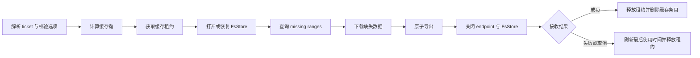

# 持久接收缓存与跨进程续传设计

## 1. 术语表与命名约定

| 规范名称 | English / 缩写 | 职责边界 | 不代表什么 |
| --- | --- | --- | --- |
| 持久接收缓存 | Persistent Receive Cache | 在多个 receive 进程之间复用 iroh 已验证的 blob 数据 | 不是最终下载目录，也不是云端存储 |
| 缓存根目录 | Cache Root | 用户明确配置、由 sendmer 管理的缓存命名空间 | 不是系统临时目录或 AlterSendmer 私有目录结构 |
| 缓存条目 | Cache Entry | 由内容哈希与 blob 格式唯一标识的一份 `FsStore` | 不按 ticket、发送方地址或文件名区分 |
| 缓存租约 | Cache Lease | receive 进程对一个缓存条目持有的跨进程排他锁 | 不是网络会话、ticket 有效期或长期所有权 |
| 缓存清理 | Cache Prune | 删除已过期且当前未被租约占用的缓存条目 | 不删除最终下载文件或活跃缓存 |
| 跨进程续传 | Cross-process Resume | 新 receive 进程从持久缓存中已有的缺失范围继续请求 | 不是发送方离线后继续，也不保证 ticket 永久可用 |
| 原子导出 | Atomic Export | 完整下载后从缓存复制到 staging，再 no-replace 提交最终根 | 不表示缓存条目自身是用户文件 |

本文后续统一使用上述规范名称。核心传输层负责缓存格式、锁、恢复和清理；桌面客户端只
配置公开 API，并展示核心事件，不读取或修改缓存内部文件。

## 2. 目标与非目标

### 2.1 目标

- 默认行为保持不变：未显式配置缓存根目录时继续使用进程级临时 store，成功、失败或取消后清理。
- 显式启用后，以内容哈希和 blob 格式复用同一 `iroh_blobs::store::fs::FsStore`。
- receive 失败、超时、断网或取消后保留已验证数据；下次 receive 通过 `local().missing()` 只请求缺失范围。
- 同一缓存条目同一时间只允许一个写入者，避免两个进程同时操作同一个 `blobs.db`。
- 缓存条目具有版本化元数据和 TTL；清理只删除过期且未锁定的条目。
- 完整下载仍经过现有原子导出和 no-replace 提交，不把缓存目录直接暴露为最终文件。

### 2.2 非目标

- 本阶段不改变 iroh wire protocol，也不创建 sendmer 私有传输协议。
- 不承诺发送方退出、ticket 被撤销或网络永远不可达时仍能完成传输。
- 不缓存完整 ticket、发送方 Endpoint ID、relay URL、最终绝对路径或 GUI 历史。
- 不在 AlterSendmer 中实现第二套缓存数据库、锁或迁移逻辑。
- 不把缓存当作备份；成功导出后默认删除对应条目，除非未来公开策略明确允许保留。

## 3. 所有权与目录布局

缓存根目录只能通过公开 receive 配置显式提供。核心传输层创建并管理以下布局：

```text
<cache-root>/
  v1/
    <format>-<content-hash>/
      manifest.json
      .lock
      blobs.db
      data/
      temp/
```

- `v1` 是 sendmer 缓存布局版本，不等同于 sendmer crate 版本或 iroh 数据库版本。
- `<format>` 使用稳定数字标识；`0` 表示 raw，`1` 表示 hash sequence。
- `<content-hash>` 使用小写十六进制。目录名不包含 ticket 或发送方网络地址。
- `manifest.json` 只保存布局版本、缓存键、创建时间和 TTL。
- `.lock` 使用操作系统 advisory lock。进程崩溃时句柄由操作系统释放，文件本身保留供后续复用。
- iroh 拥有 `blobs.db`、`data` 和 `temp` 的内部格式；sendmer 不解析或修改这些文件。

缓存根目录可能揭示内容哈希，因此必须视为用户私有应用数据。日志与事件不得输出完整缓存
根路径；诊断信息最多输出缓存是否启用、命中状态和安全错误摘要。

## 4. 状态与生命周期



关键顺序固定为：先关闭 endpoint，再等待 `FsStore::shutdown()`，然后释放缓存租约，最后按
结果保留或删除目录。Windows 上不得在 store actor 仍持有文件句柄时删除缓存条目。

失败或取消后保留缓存不改变最终输出语义：staging 目录仍必须删除，最终目标仍保持不存在或
保持原内容。成功导出后默认删除缓存条目，避免同一内容长期占用两份磁盘空间。

## 5. 锁与并发规则

- 缓存租约是单条目排他锁，使用非阻塞获取；锁被占用时 receive 立即返回稳定的“缓存正在使用”错误。
- 不等待锁，避免 CLI 或 GUI 在没有可见进度的情况下无限挂起。
- 不删除单独的 `.lock` 文件；删除并重建锁文件会让不同进程锁住不同 inode/handle，破坏互斥。
- 缓存清理先尝试获取同一排他锁，只有获取成功后才允许删除条目。
- 进程崩溃无需猜测 PID 是否存活；操作系统释放 advisory lock 后，下一进程可以恢复条目。
- advisory lock 只能协调遵守约定的 sendmer 进程。恶意本地进程仍可篡改缓存，属于本机信任边界。

## 6. TTL、清理与崩溃恢复

- TTL 从缓存条目最后一次成功获取租约的时间计算，默认建议为 7 天。
- 每次获取租约时刷新 `.lock` 的修改时间；活跃租约即使超过 TTL 也不得被清理。
- 自动清理可以在打开缓存根目录时执行；显式 `cache prune` 命令使用同一库函数。
- 清理只扫描当前布局版本下、名称和元数据均合法的直接子目录。未知文件和未来布局版本不删除。
- 元数据缺失、格式不匹配或 schema 版本过新时，receive 以缓存损坏错误失败，不静默重建或覆盖。
- 进程崩溃后，iroh store 保留已落盘的完整或部分 range；下次打开后仍由 iroh 校验内容并计算缺失范围。
- 若 iroh 自身无法打开旧数据库，核心传输层报告缓存损坏；用户可显式清理该条目后重新下载。

## 7. 公开 API 与 CLI 方向

核心 API 增加可选的 `ReceiveCacheOptions`：

```rust
pub struct ReceiveCacheOptions {
    pub root_dir: PathBuf,
    pub ttl: Duration,
}
```

`ReceiveOptions` 持有 `Option<ReceiveCacheOptions>`；`None` 保持当前临时缓存行为。首个实现切片
提供 `receive --cache-dir <DIR>` 和 `--cache-ttl-seconds <SECONDS>`，零 TTL 在创建 endpoint
或缓存目录前拒绝。后续 `sendmer cache prune` 只调用公开的清理 API，不复制扫描规则。

AlterSendmer 必须等正式 sendmer 版本发布后才增加“跨进程续传”开关、缓存位置和清理入口；
不得使用 path 或 Git 依赖提前接入。

## 8. 持久化格式与迁移

- `manifest.json.schema_version` 从 `1` 开始。
- 当前代码只读写 schema `1`。遇到更高版本时 fail closed，避免旧客户端破坏新格式。
- 同一 schema 内只能增加具有默认值的可选字段；改变缓存键、锁或目录语义时必须升级布局目录。
- iroh 的内部数据库迁移由 iroh 负责；sendmer 只固定自己拥有的 manifest 和目录边界。
- AlterSendmer 版本、语言、主题和传输历史不得进入 manifest。

## 9. 测试与验收

第一阶段必须覆盖：

- 未配置缓存时仍创建并清理 `.sendmer-recv-*` 临时目录。
- 相同 hash/format 产生相同缓存条目，不同格式产生不同条目。
- 第二个进程或文件句柄无法同时获取同一条目的缓存租约。
- 失败或取消后缓存条目保留，成功导出后缓存条目删除。
- 释放租约并重新打开后，iroh 能看到此前已落盘的数据并只请求缺失范围。
- 过期、未锁定条目会被清理；活跃、未知或未来 schema 条目不会被删除。
- 损坏 manifest、零 TTL、cache root 为文件或符号链接时在网络初始化前失败。
- Windows 上 store shutdown、解锁、删除顺序不产生文件锁残留。

阶段门禁：

```text
cargo fmt --all -- --check
cargo clippy --locked --workspace --all-targets --all-features -- -D warnings
cargo test --locked --workspace --all-features --bins --tests --examples
cargo check --workspace --all-features --bins
```

在真实跨进程中断恢复、Windows 文件锁和 TTL 清理 E2E 完成前，不发布 `v0.9.0`，也不让
AlterSendmer 宣称“断点续传已完成”。

## 10. 分阶段实施顺序

1. 增加版本化缓存租约、公开选项、失败保留/成功删除和确定性单元测试。
2. 增加显式清理命令、自动清理和缓存诊断事件。
3. 增加真实跨进程中断恢复、Windows 文件锁、弱网和大文件 E2E。
4. 完成 sendmer `v0.9.0` 发布，再由 AlterSendmer 使用 crates.io 正式版本接入 UI。
